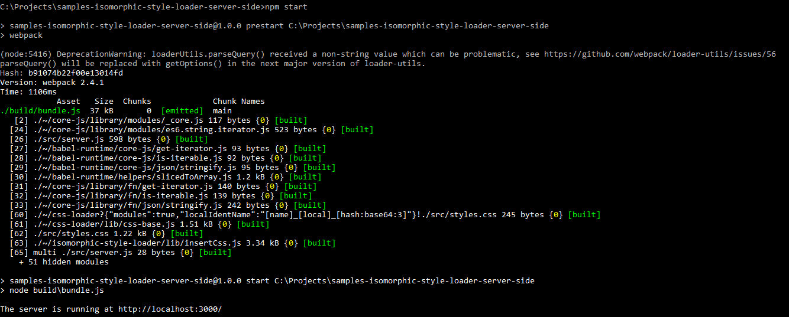
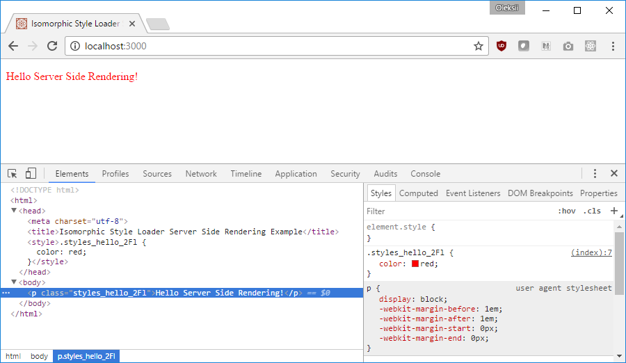

# Minimal [isomorphic-style-loader](https://github.com/kriasoft/isomorphic-style-loader) server-side rendering example for [Webpack](http://webpack.github.io)

### Intro

This is minimal working sample of server-side styles rendering with [isomorphic-style-loader](https://github.com/kriasoft/isomorphic-style-loader). The most important part that most people miss is that it is required to bundle server side code using webpack in order for [isomorphic-style-loader](https://github.com/kriasoft/isomorphic-style-loader) to work. This sample provides starting point and minmal configuration that one can use to play with [isomorphic-style-loader](https://github.com/kriasoft/isomorphic-style-loader)

### Install

Run following commands:

```
git clone https://github.com/boades/samples-isomorphic-style-loader-server-side.git
cd samples-isomorphic-style-loader-server-side
npm install
```

### Run 

```
npm run 
```

The output should be simillar to this: 



### Check

Open browser and navigate to [http://localhost:3000/](http://localhost:3000/).



Open `src/server.js` and `src/styles.css`, check how `.hello` style has been transformed by `css-loader` and how it was rendered by `styles._getCss()` method on the page.

### Other

[React Start Kit](https://github.com/kriasoft/react-starter-kit)